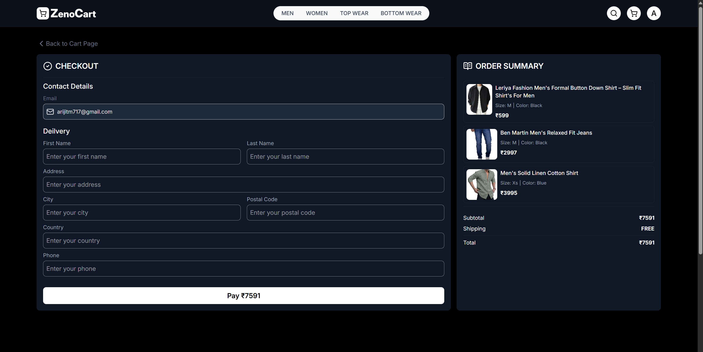

# ZenoCart 🛒

A modern, full-stack e-commerce platform built with React and Node.js, featuring a sleek user interface and robust backend functionality.

## 🌐 Live Demo

🔗 **Live URL**: [https://zenocart.vercel.app](https://your-live-url-here.com)

## 📸 Screenshots

| Page                 | Screenshot                                            | Description                                                       |
| -------------------- | ----------------------------------------------------- | ----------------------------------------------------------------- |
| **Homepage**         |                | Clean and modern homepage with featured products and hero section |
| **Product Catalog**  |          | Browse through our extensive product collection with filters      |
| **Product Details**  |  | Detailed product view with images and specifications              |
| **Shopping Cart**    |               | Seamless cart experience with real-time updates                   |
| **Checkout Process** |                | Secure checkout with Razorpay integration                         |
| **User Profile**     |             | User dashboard with order history and profile settings            |
| **Admin Dashboard**  |  | Comprehensive admin panel for managing products and orders        |
| **Order Management** |    | Admin interface for tracking and managing customer orders         |

## 🚀 Features

- **Modern Frontend**: Built with React 19 and styled with Tailwind CSS
- **State Management**: Redux Toolkit for efficient state handling
- **Responsive Design**: Mobile-first design approach
- **Payment Integration**: Razorpay payment gateway
- **Image Management**: Cloudinary integration for optimized image handling
- **Authentication**: Secure JWT-based authentication
- **Real-time Notifications**: React Hot Toast for user feedback

## 🛠️ Tech Stack

### Frontend

- **React** 19.1.0 - Modern UI library
- **Redux Toolkit** - State management
- **React Router DOM** - Client-side routing
- **Tailwind CSS** - Utility-first CSS framework
- **Lucide React** - Beautiful icons
- **Axios** - HTTP client
- **React Hot Toast** - Toast notifications
- **React Simple Typewriter** - Typewriter effects
- **Vite** - Fast build tool

### Backend

- **Node.js** with **Express** - Server framework
- **MongoDB** with **Mongoose** - Database and ODM
- **JWT** - Authentication tokens
- **bcryptjs** - Password hashing
- **Cloudinary** - Image storage and optimization
- **Razorpay** - Payment processing
- **Multer** - File upload handling
- **CORS** - Cross-origin resource sharing
- **Morgan** - HTTP request logger

## 📋 Prerequisites

Before running this project, make sure you have:

- **Node.js** (v16 or higher)
- **npm** or **yarn**
- **MongoDB** (local installation or MongoDB Atlas)
- **Cloudinary account** (for image management)
- **Razorpay account** (for payment processing)

## 🚦 Getting Started

### 1. Clone the Repository

```bash
git clone <repository-url>
cd zenocart
```

### 2. Backend Setup

```bash
cd backend
npm install
```

Create a `.env` file in the backend directory:

```env
PORT=4000
CLIENT_URL=http://localhost:5173
NODE_ENV=development
MONGO_URI=your_mongodb_connection_string
JWT_SECRET=your_jwt_secret_key
CLOUDINARY_CLOUD_NAME=your_cloudinary_cloud_name
CLOUDINARY_API_KEY=your_cloudinary_api_key
CLOUDINARY_API_SECRET=your_cloudinary_api_secret
RAZORPAY_KEY_ID=your_razorpay_key_id
RAZORPAY_KEY_SECRET=your_razorpay_key_secret
```

Start the backend server:

```bash
npm run dev
```

### 3. Frontend Setup

```bash
cd frontend
npm install
```

Create a `.env` file in the frontend directory:

```env
VITE_API_URL=http://localhost:5000
VITE_RAZORPAY_KEY_ID=your_razorpay_key_id
```

Start the frontend development server:

```bash
npm run dev
```

## 📁 Project Structure

```
zenocart/
├── frontend/
│   ├── src/
│   │   ├── components/
│   │   ├── assets/
│   │   ├── pages/
│   │   ├── app/
│   │   ├── features/
│   │   ├── lib/
│   │   └── App.jsx
│   ├── public/
│   └── package.json
├── backend/
│   ├── src/
│   │   ├── controllers/
│   │   ├── models/
│   │   ├── routes/
│   │   ├── middleware/
│   │   ├── utils/
│   │   ├── db/
│   │   └── server.js
│   └── package.json
└── README.md
```

## 🔧 Available Scripts

### Frontend

- `npm run dev` - Start development server
- `npm run build` - Build for production
- `npm run preview` - Preview production build
- `npm run lint` - Run ESLint

### Backend

- `npm run dev` - Start development server with nodemon
- `npm start` - Start production server
- `npm run seed` - Seed database with sample data

## 🌟 Key Features

### User Features

- User registration and authentication
- Product browsing and search
- Shopping cart management
- Order placement and tracking
- User profile management
- Payment processing with Razorpay

### Admin Features

- Product management
- Order management
- User management
- Dashboard analytics
- Image upload and management

## 📦 Database Seeding

To populate your database with sample data:

```bash
cd backend
npm run seed
```

## 🚀 Deployment

### Frontend Deployment

1. Build the frontend:
   ```bash
   cd frontend
   npm run build
   ```
2. Deploy the `dist` folder to your hosting platform (Vercel, Netlify, etc.)

### Backend Deployment

1. Set up environment variables on your hosting platform
2. Deploy to platforms like Heroku, Railway, or DigitalOcean
3. Ensure MongoDB connection is properly configured

## 🤝 Contributing

1. Fork the repository
2. Create a feature branch (`git checkout -b feature/AmazingFeature`)
3. Commit your changes (`git commit -m 'Add some AmazingFeature'`)
4. Push to the branch (`git push origin feature/AmazingFeature`)
5. Open a Pull Request

## 📄 License

This project is licensed under the ISC License.

## 👨‍💻 Author

**Arijit Mondal**

## 📞 Support

If you have any questions or need help with setup, please open an issue in the repository.

---

**Happy Shopping with ZenoCart! 🛍️**
